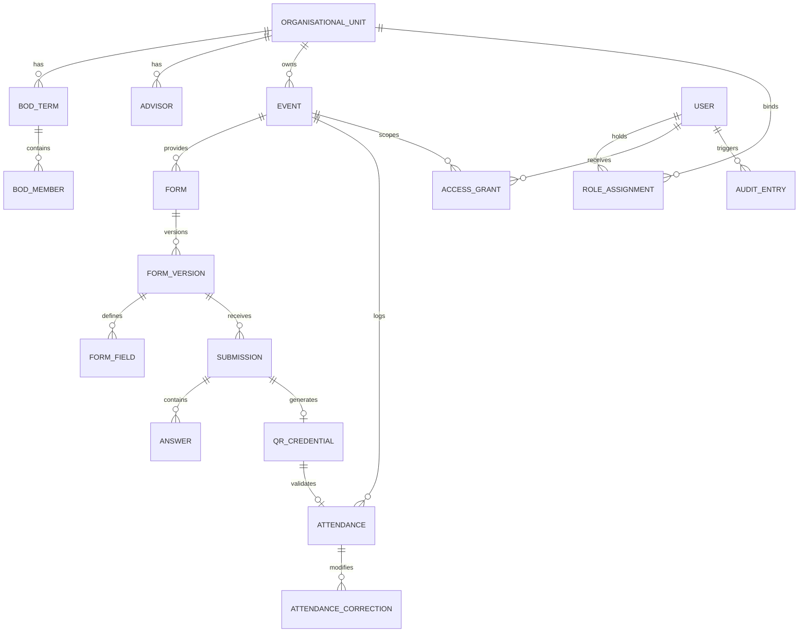

# IEEE UWU Student Branch Website — Structured Software Requirements Specification (v1.1)

**Source:** Requirements Draft for Review (2 October 2026)  
**Status:** Draft for Requirements Review  
**Target Organization:** IEEE UWU Student Branch (Main SB, IAS, CS, RAS Chapters, WIE Affinity Group)

---

## 1. Document & System Metadata

| Attribute | Specification |
| :--- | :--- |
| **System Name** | IEEE UWU Student Branch Website |
| **Target Units** | 5 Units: Main SB, IAS Chapter, CS Chapter, RAS Chapter, WIE Affinity Group |
| **Primary Scope** | Public branding, chapter administration, executive committee archive, event publishing, dynamic registration forms, OC recruitment, and real-time physical QR attendance. |
| **Authentication Policy** | Single shared login page for administrative users; students and visitors access forms/pages without login. |
| **Timezone Basis** | Asia/Colombo (`UTC+05:30`) |

### Requirement Classification Key
* **[C] Confirmed:** Mandated by baseline requirements or explicit user choices.
* **[D] Derived:** Engineering implementation detail proposed to make requirements operational.
* **[O] Optional:** Extension outside initial delivery scope.

---

## 2. Organizational Units & Architecture Scope

| Code | Unit Name | Unit Type | Scope & URL Territory |
| :--- | :--- | :--- | :--- |
| **SB** | Main Student Branch | Student Branch | Root entry point, branch-wide content, overarching administration |
| **IAS** | Industry Applications Society | Chapter | Dedicated chapter page, advisors, BOD, owned events |
| **CS** | Computer Society | Chapter | Dedicated chapter page, advisors, BOD, owned events |
| **RAS** | Robotics and Automation Society | Chapter | Dedicated chapter page, advisors, BOD, owned events |
| **WIE** | Women in Engineering | Affinity Group | Dedicated affinity group page, advisors, BOD, owned events |

---

## 3. User Roles & Access Boundaries

| Role | Operational Scope | Default Capabilities |
| :--- | :--- | :--- |
| **Public Visitor / Student** | Public site & forms | Browse published content; submit participant & OC forms without authentication. |
| **SB Webmaster** | Global (All 5 Units) | Full administration, user creation, explicit permission grant delegation, audit inspection. |
| **SB Secretary** | Cross-Unit Response Scope | View all participant registrations and OC submissions across all 5 units. Content editing requires grant. |
| **SB Chairperson** | Individual Account | Assigned account; operational access governed by explicit grants. |
| **Unit Webmaster** | Assigned Unit Only | Manage assigned unit profile, advisors, committee rosters, and unit events. |
| **Unit Secretary / Chair** | Assigned Unit | Individual administrative account; access to responses or editing requires explicit grants. |
| **Project Chair / Delegate** | Specific Assigned Event | Granted granular access (e.g. view OC responses or scan QR) scoped strictly to one event. |
| **Attendance Operator** | Specific Assigned Event | Check-in permission to scan attendee QR codes or perform manual check-in for that event. |

---

## 4. RBAC & Granular Permission System

### 4.1 Feature Keys
* `unit.details.manage`: Update unit metadata, description, advisors.
* `unit.bod.manage`: Manage executive committee terms and member rosters.
* `event.manage`: Create and modify event information.
* `event.publish`: Publish, unpublish, or cancel events.
* `form.manage`: Build and configure registration/OC forms.
* `registration.view` / `registration.export`: View / export participant registration lists.
* `oc.view` / `oc.export` / `oc.decide`: View / export / review OC applications.
* `attendance.scan` / `attendance.correct`: Scan QR check-in / adjust check-in records.
* `account.manage` / `permission.manage`: Administer users / administer permission grants.
* `audit.view`: Inspect audit trails.

### 4.2 Baseline Permission Matrix
*Legend: `A` = Default Access; `S` = Scoped to Assigned Unit; `G` = Requires Explicit Grant; `—` = No Access.*

| Feature Key / Action | SB Webmaster | Unit Webmaster | SB Secretary | Other Staff / Delegated |
| :--- | :---: | :---: | :---: | :---: |
| Edit unit details, advisors, BOD | **A** | **S** | **G** | **G** |
| Create and edit events | **A** | **S** | **G** | **G** |
| Publish owned events | **A** | **S** | **G** | **G** |
| Build event and OC forms | **A** | **S** | **G** | **G** |
| View participant responses | **A** | **G** | **A** | **G** |
| View OC applications | **A** | **G** | **A** | **G** |
| Export private responses | **A** | **G** | **G** | **G** |
| Record OC decisions | **A** | **G** | **G** | **G** |
| Scan QR attendance | **A** | **G** | **G** | **G** |
| Correct attendance records | **A** | **G** | **G** | **G** |
| Manage accounts & grants | **A** | **—** | **—** | **—** |
| View security/audit trail | **A** | **—** | **—** | **—** |

---

## 5. Functional Requirements Catalog

### 5.1 Accounts & Authentication
* **FR-ACC-01 [C] Shared Login:** Single shared login page for all administrative users with post-auth dashboard routing based on role/permissions.
* **FR-ACC-02 [C] Account Creation:** Only SB Webmaster creates administrative accounts and assigns roles/units.
* **FR-ACC-03 [D] Account Record:** Stores user ID, name, login identity, assigned roles, units, status, creator, timestamp.
* **FR-ACC-04 [D] Activation & Recovery:** Secure password setup/reset without plaintext credential dispatch.
* **FR-ACC-05 [D] Suspension & Handover:** Immediate session invalidation upon suspension; audit attribution retained.
* **FR-ACC-06 [D] Session Management:** Server-side session expiry; permission updates take effect on next request.
* **FR-ACC-07 [D] Multiple Assignments:** Supports multiple roles/unit assignments per user without shared accounts.

### 5.2 Access Control & Authorization
* **FR-AUTH-01 [C] SB Webmaster Global Scope:** Global access across SB, IAS, CS, RAS, and WIE.
* **FR-AUTH-02 [C] Unit Webmaster Boundaries:** Unit Webmaster scoped strictly to assigned unit.
* **FR-AUTH-03 [C] SB Secretary Scope:** Unrestricted view access to participant and OC responses across all 5 units.
* **FR-AUTH-04 [C] Granular Feature Grants:** SB Webmaster can grant fine-grained permissions per resource (unit or single event).
* **FR-AUTH-05 [C] Persistent Access Table:** Relational table tracking user, feature, scope, grantor, expiry.
* **FR-AUTH-06 [D] Default Denial:** Unlisted operations default to denied; event grants do not spill over to sibling events.
* **FR-AUTH-07 [D] Segregated Permissions:** Editing an event does not confer response-viewing or export privileges.
* **FR-AUTH-08 [D] Server-Side Enforcement:** Validation occurs strictly server-side on routes, APIs, and exports.
* **FR-AUTH-09 [D] Grant Lifecycle:** Supports time limits, active status, and explicit revocations.
* **FR-AUTH-10 [D] Non-Delegable Admin:** Only SB Webmaster manages accounts and grants.
* **FR-AUTH-11 [D] Scope Validation:** Event grants validate against parent unit ownership.
* **FR-AUTH-12 [D] Effective Access Inspection:** UI visualizes baseline role rights vs explicit active grants.
* **FR-AUTH-13 [D] Protected Audit Log:** Immutable logs for all account, role, and permission modifications.

### 5.3 Public Pages & Unit Profiles
* **FR-PUB-01 [C] Dedicated Unit Pages:** Individual landing pages for SB, IAS, CS, RAS, and WIE.
* **FR-PUB-02 [C] Event Discovery:** Global and unit-filtered event listings showing ownership and form links.
* **FR-PUB-03 [D] Unit Details:** Display name, mission, description, logo, advisors, and social channels.
* **FR-PUB-04 [D] Event Filtering & Permalinks:** Filter by unit, status (upcoming/past); stable shareable URLs.
* **FR-PUB-05 [D] Publication Lifecycle:** Explicit draft, preview, published, and unpublished states.
* **FR-UNIT-01 [C] Scoped Unit Editing:** Unit webmaster modifies only their assigned unit.
* **FR-UNIT-02 [D] Advisor Records:** Supports multiple advisors with titles, terms, photos, and contact info.
* **FR-UNIT-03 [D] Data Privacy:** Administrative account details never exposed as public contact channels.
* **FR-UNIT-04 [D] Media Handling:** Strict sanitization, image file type/size limits, mandatory alt text.

### 5.4 Executive Committee (BOD / ExCom) Archive
* **FR-BOD-01 [C] Unified Terminology:** BOD and ExCom represent the same entity; maintains current and historical records.
* **FR-BOD-02 [C] Tiered Committees:** Preserves distinct Junior and Senior categories within every committee term.
* **FR-BOD-03 [D] Term Management:** Tracks term label, unit, date ranges, status (current/past), and publication flag.
* **FR-BOD-04 [D] Member Profiles:** Name, position, tier (Junior/Senior), display order, image, optional bio.
* **FR-BOD-05 [D] Handover Workflow:** Explicit mechanism to archive active term and designate incoming term.
* **FR-BOD-06 [D] Historical Integrity:** Editing a current member does not alter historical records.
* **FR-BOD-07 [D] Historical Archive UI:** Public browsing of past terms with explicit empty states.
* **FR-BOD-08 [D] Decoupled Auth:** Adding a person to the BOD does not create an administrative account.

### 5.5 Events & Lifecycle
* **FR-EVT-01 [C] Single Unit Ownership:** Every event has exactly one owning unit.
* **FR-EVT-02 [C] Scoped Event Admin:** Unit webmaster administers only events owned by their unit.
* **FR-EVT-03 [C] Event Announcement:** Publish announcements before registration opening with dynamic form links.
* **FR-EVT-04 [D] Event Schema:** Title, description, cover photo, dates/times, mode (physical/virtual/hybrid), venue/links.
* **FR-EVT-05 [D] Schedule Validation:** Enforces end time after start time; validates owning unit.
* **FR-EVT-06 [D] Lifecycle States:** Draft, Published, Cancelled, Archived; timeline flags (Upcoming, Ongoing, Past).
* **FR-EVT-07 [D] Publishing Authorization:** Requires explicit `event.publish` permission.
* **FR-EVT-08 [D] Event Cancellation:** Automatically closes forms, disables QR scans, and badges public page.
* **FR-EVT-09 [D] Non-Destructive Archiving:** Soft archive for events with records; permanent delete barred.
* **FR-EVT-10 [D] Ownership Transfer Restraint:** Changing owning unit requires SB Webmaster approval and audit.
* **FR-EVT-11 [D] Optimistic Concurrency:** Prevents simultaneous edit overwrites.

### 5.6 Form Builder & Submissions
* **FR-FORM-01 [C] Dual Purpose Forms:** Independent Participant Registration and Organising Committee (OC) forms per event.
* **FR-FORM-02 [C] Visual Form Builder:** Dynamic builder supporting custom questions without hard-coded templates.
* **FR-FORM-03 [D] Independent Schedules:** Separate open/close windows and enabled states for Participant vs OC forms.
* **FR-FORM-04 [D] Core Question Types:** Short text, long text, number, email, phone, single choice, multiple choice, dropdown, date, headings.
* **FR-FORM-05 [D] Field Configuration:** Labels, helper text, required flags, option lists, and validation rules.
* **FR-FORM-06 [D] Core Field Mapping:** Map arbitrary questions to participant display name and deduplication ID.
* **FR-FORM-07 [D] Preview Mode:** Test layout/validation without creating live submission records.
* **FR-FORM-08 [D] Form Versioning:** Version immutable form schemas to keep historic submissions intact.
* **FR-FORM-09 [D] Non-Destructive Field Edits:** Removing fields does not delete historic responses.
* **FR-FORM-10 [D] Server Validation:** Re-validates submissions against active version schema on server.
* **FR-FORM-11 [D] Hard Submission Windows:** Rejects submissions received after configured closing time.
* **FR-FORM-12 [D] Optional Value Handling:** Accepts omitted optional values without injecting placeholders.
* **FR-FORM-13 [D] Template Cloning:** Duplicate form structures across authorized events.

### 5.7 Participant Registration & OC Applications
* **FR-REG-01 [C] Anonymous Registration:** Students register without logging in.
* **FR-REG-02 [D] Confirmation & QR:** Generates unique registration reference and QR credential (if physical event).
* **FR-REG-03 [D] Idempotent Submissions:** Prevents duplicate submissions on network retries or double-clicks.
* **FR-REG-04 [D] Deduplication Policy:** Enforces duplicate handling via mapped identifier (e.g. email or student ID).
* **FR-REG-05 [D] Privacy by Default:** Submissions and QR codes inaccessible to unauthorized parties.
* **FR-REG-06 [D] Atomic Capacity Limits:** Concurrency-safe attendee caps with automatic closure.
* **FR-OC-01 [C] Anonymous OC Applications:** Separate form for OC recruitment without user login.
* **FR-OC-02 [D] Segregated Storage:** OC submissions strictly isolated from attendee registrations.
* **FR-OC-03 [D] OC Acknowledgement:** Provides distinct application reference; does not generate attendee QR code.
* **FR-OC-04 [O] OC Review Workflow:** Optional status tracking (`pending`, `shortlisted`, `selected`, `rejected`).

### 5.8 Response Management
* **FR-RESP-01 [C] SB Secretary Visibility:** Full cross-unit view access to attendee and OC responses.
* **FR-RESP-02 [D] Scoped Data Access:** Displays data only for permitted events.
* **FR-RESP-03 [D] Search & Filter:** Filter by submission timestamp, status, keyword search.
* **FR-RESP-04 [D] CSV Export:** Export responses with formula-injection sanitization (escaping `=`, `+`, `-`, `@`).
* **FR-RESP-05 [D] Immutability:** Answers cannot be silently modified by staff.
* **FR-RESP-06 [D] Registration Revocation:** Invalidate fraudulent or duplicate registrations with audit logging.
* **FR-RESP-07 [D] Privacy Disclosures:** Mandatory data usage disclosures on every form.

### 5.9 QR Credentials & Real-Time Attendance
* **FR-QR-01 [C] QR Mechanism:** QR pass generation for attendees and scanning for check-in.
* **FR-QR-02 [D] Event-Bound Opaque Token:** Unique unguessable hash; contains no raw PII in barcode payload.
* **FR-QR-03 [D] Credential Display:** Immediate display on confirmation screen; printable/scannable on mobile screens.
* **FR-QR-04 [D] Scanner Access Gate:** Scanner requires logged-in user with `attendance.scan` permission.
* **FR-QR-05 [D] Verification Sequence:** Validates operator rights, event status, check-in window, and pass state.
* **FR-QR-06 [D] Atomic Check-In:** Prevents concurrent duplicate check-ins across multiple scanners.
* **FR-QR-07 [D] Duplicate Scan Handling:** Repeated scan displays timestamp of prior scan without re-recording.
* **FR-QR-08 [D] Minimal Identity Display:** Scanner reveals only name and registration ref for verification.
* **FR-QR-09 [D] Rich Scan Feedback:** Clear UI feedback for valid, already-scanned, invalid event, or expired passes.
* **FR-QR-10 [D] Manual Fallback:** Manual code lookup when camera hardware is unavailable.
* **FR-QR-11 [D] Token Reissuance:** SB Webmaster can revoke and reissue tokens while preserving attendance status.
* **FR-QR-12 [D] Attendance Corrections:** Audited status correction with mandatory justification reason.
* **FR-QR-13 [D] Attendance Reporting:** Breakdown of registered, attended, and absent counts.
* **FR-QR-14 [D] Online-First Operation:** Requires live server confirmation; offline scans are optional extension.

### 5.10 Administration & Operations
* **FR-ADM-01 [D] Role Dashboard:** Personalized dashboard showing permitted units, actions, and counts.
* **FR-ADM-02 [D] System Audit Log:** Tracks publishes, permission grants, exports, account changes, and scan corrections.
* **FR-ADM-03 [D] Office Handover:** Guided workflow to transition committee terms and audit permissions.
* **FR-ADM-04 [D] Secrets Protection:** System secrets isolated from content admin panels.
* **FR-ADM-05 [D] Soft Deletion:** Protected response and attendance tables protected against cascading deletes.
* **FR-ADM-06 [D] Error Handling:** Sanitized operational errors preventing PII or stack disclosure.

---

## 6. Logical Data Model

### Entity Schema Summary
1. **OrganisationalUnit:** `id`, `type` (SB|IAS|CS|RAS|WIE), `name`, `slug`, `description`, `publication_state`.
2. **User:** `id`, `name`, `login_identifier`, `password_hash`, `status` (active|suspended), `created_at`.
3. **RoleAssignment:** `id`, `user_id`, `role`, `unit_id`, `is_active`, `valid_from`, `valid_until`.
4. **AccessGrant:** `grant_id`, `user_id`, `feature_key`, `scope_type` (UNIT|EVENT), `scope_id`, `granted_by`, `granted_at`, `valid_from`, `valid_until`, `status` (active|revoked), `revocation_reason`.
5. **AdvisorAssignment:** `id`, `name`, `designation`, `image_url`, `unit_id`, `term_label`, `is_public`.
6. **BodTerm:** `id`, `unit_id`, `term_label`, `start_date`, `end_date`, `state` (present|past), `is_published`.
7. **BodMemberAssignment:** `id`, `term_id`, `name`, `position`, `category` (junior|senior), `display_order`, `image_url`.
8. **Event:** `id`, `unit_id`, `title`, `slug`, `mode` (physical|virtual|hybrid), `venue`, `start_time`, `end_time`, `state` (draft|published|cancelled|archived).
9. **Form:** `id`, `event_id`, `purpose` (participant|oc), `title`, `is_enabled`, `open_at`, `close_at`.
10. **FormVersion:** `id`, `form_id`, `version_number`, `published_at`, `schema_json`.
11. **FormField:** `id`, `version_id`, `field_key`, `type`, `label`, `is_required`, `options_json`, `validation_rules_json`.
12. **Submission:** `id`, `event_id`, `form_version_id`, `purpose`, `reference_code`, `status` (valid|invalidated), `submitted_at`.
13. **Answer:** `id`, `submission_id`, `field_id`, `value_text`, `value_json`.
14. **QrCredential:** `id`, `submission_id`, `event_id`, `token_hash`, `status` (active|revoked|replaced), `issued_at`.
15. **Attendance:** `id`, `registration_id`, `event_id`, `scanned_by_user_id`, `scanned_at`, `method` (qr|manual), `status` (attended|voided).
16. **AttendanceCorrection:** `id`, `attendance_id`, `actor_user_id`, `reason`, `old_status`, `new_status`, `created_at`.
17. **AuditEntry:** `id`, `actor_user_id`, `action`, `resource_type`, `resource_id`, `details_json`, `created_at`.

---

## 7. Business Rules (BR-01 to BR-25)

* **BR-01:** One event has exactly one owning organizational unit.
* **BR-02:** A form accepts submissions only when the event is published, the form is enabled, and the submission window is open.
* **BR-03:** Participant and OC forms operate on completely independent opening and closing schedules.
* **BR-04:** An OC application does not confer participant registration or staff account privileges.
* **BR-05:** Event cancellation immediately shuts down both forms and revokes QR check-in capabilities.
* **BR-06:** Past events remain publicly readable, but all response records remain strictly private.
* **BR-07:** Subsequent form updates do not rewrite or delete historical submission data.
* **BR-08:** Network retries sharing the same transaction token do not generate duplicate submissions.
* **BR-09:** Administrative role titles do not bypass resource boundary checks.
* **BR-10:** Only the SB Webmaster has authority to create accounts and allocate permission grants.
* **BR-11:** Unit Webmaster editing permissions are constrained strictly to the assigned unit.
* **BR-12:** The SB Secretary has read permissions for participant and OC responses across all 5 units.
* **BR-13:** An event-level grant confers access exclusively to the target event.
* **BR-14:** Viewing, exporting, form authoring, scanning, and attendance correction are treated as separate permissions.
* **BR-15:** Unauthorized users receive HTTP 403 / denied responses on direct URLs and API endpoints.
* **BR-16:** A QR credential is cryptographically bound to a single participant registration and a single event.
* **BR-17:** Check-in records can only be created by operators possessing active `attendance.scan` rights.
* **BR-18:** Each participant registration can have at most one effective attendance record per event.
* **BR-19:** Replacing or reissuing a QR pass retains the existing check-in status.
* **BR-20:** OC applicants are ineligible for participant QR check-in unless registered separately.
* **BR-21:** Possessing a QR credential proves registration, not personal photo identity.
* **BR-22:** Every BOD profile must belong to a unit, a term, and either the Junior or Senior category.
* **BR-23:** Past BOD records are permanently preserved when new current terms are designated.
* **BR-24:** Executive committee listings and administrative accounts are strictly decoupled.
* **BR-25:** Units enforce a single active current BOD term policy unless separate Junior/Senior terms are agreed.

---

## 8. Acceptance Test Matrix (AT-01 to AT-26)

| ID | Test Scenario | Verified Requirements |
| :--- | :--- | :--- |
| **AT-01** | Open all 5 unit pages; verify each renders its own distinct content, advisors, and events. | FR-PUB-01, FR-EVT-01 |
| **AT-02** | Log in as CS Webmaster; edit CS content successfully; verify RAS editing fails via UI and direct API. | FR-AUTH-02, 06, 08; FR-UNIT-01 |
| **AT-03** | Log in as SB Webmaster; verify global administrative rights across all units. | FR-AUTH-01 |
| **AT-04** | Log in as SB Secretary; verify viewing responses across all units; verify user admin is denied. | FR-AUTH-03, 10; FR-RESP-01 |
| **AT-05** | Grant CS Secretary `registration.view` on Event A; verify view works for A but fails for OC and Event B. | FR-AUTH-04–08; FR-RESP-04 |
| **AT-06** | Revoke Event A grant; verify subsequent requests are blocked immediately. | FR-AUTH-09, 12; NFR-SEC-05 |
| **AT-07** | Open event with closed registration and open OC form; verify only OC accepts submissions. | FR-EVT-03; FR-FORM-03, 11 |
| **AT-08** | Build custom form; verify valid submissions succeed and invalid/missing fields fail server-side. | FR-FORM-02, 04, 05, 10, 12 |
| **AT-09** | Submit forms without login; verify participant form yields QR pass and OC form yields reference only. | FR-REG-01, 02; FR-OC-01–03 |
| **AT-10** | Replay submission payload; verify idempotent transaction prevents duplicate registration. | FR-REG-03; BR-08 |
| **AT-11** | Update form schema after receiving submissions; verify legacy answers display original labels. | FR-FORM-08, 09 |
| **AT-12** | Submit after form deadline or event cancellation; verify server rejection. | FR-FORM-11; FR-EVT-08 |
| **AT-13** | Scan Event A QR code with Event A operator; verify scan success; test with Event B QR and verify rejection. | FR-QR-04–06 |
| **AT-14** | Perform concurrent scans of the same QR on two devices; verify exactly 1 check-in and 1 duplicate notice. | FR-QR-06, 07; NFR-REL-01 |
| **AT-15** | Attempt scan validation without auth or permissions; verify 0 data leaked and no check-in logged. | FR-AUTH-08; FR-QR-04, 08 |
| **AT-16** | Revoke and reissue QR; verify old pass fails and new pass preserves prior attendance status. | FR-QR-05, 11; FR-RESP-06 |
| **AT-17** | Perform manual fallback check-in; verify audit marks method as manual; verify offline fails safely. | FR-QR-10, 14 |
| **AT-18** | Correct attendance with `attendance.correct`; verify reason is required and audit history preserved. | FR-AUTH-07; FR-QR-12 |
| **AT-19** | Manage current and past BOD terms; verify editing current term does not corrupt past records. | FR-BOD-01–07 |
| **AT-20** | Add BOD member or transition term; verify administrative user accounts remain unaffected. | FR-BOD-08; FR-ADM-03 |
| **AT-21** | Export CSV containing formula prefixes (`=`, `@`, `+`); verify safe sanitization upon export. | FR-RESP-04; NFR-SEC-04 |
| **AT-22** | Trigger concurrent event edits; verify optimistic lock prevents silent data loss. | FR-EVT-11 |
| **AT-23** | Suspend account with active session; verify next request fails immediately. | FR-ACC-05; FR-AUTH-13 |
| **AT-24** | Test backup restoration; verify schema, submissions, grants, and attendance are intact. | NFR-REL-02 |
| **AT-25** | Execute mobile UI, camera scanner, and keyboard accessibility tests across target browsers. | NFR-USE-01–03; NFR-PERF-01 |
| **AT-26** | Log in with different roles via shared login; verify correct scoped dashboard routing. | FR-ACC-01; FR-ADM-01; FR-AUTH-08 |

---

## 9. Non-Functional Requirements & Governance

* **NFR-SEC-01 (Transport & Passwords):** HTTPS enforcement, adaptive password hashing (bcrypt/argon2), zero plain credentials in logs.
* **NFR-SEC-02 (Injection & CSRF):** Parameterized queries, sanitization, CSRF tokens, strict object-level access validation.
* **NFR-SEC-03 (Rate Limiting):** Endpoint rate limiting on login, password reset, public submissions, and QR scans.
* **NFR-SEC-04 (Formula Injection):** CSV exports sanitize Excel/Sheets formula prefixes (`=`, `+`, `-`, `@`).
* **NFR-USE-01 (Responsive Design):** Fluid desktop and mobile interfaces without horizontal scrolling.
* **NFR-REL-01 (ACID Transactions):** Atomic transactions for capacity limits and attendance logging.
* **NFR-PERF-01 (Target Performance):** Load-tested for concurrent registration spikes and QR operator bursts.

---

## 10. Open Decisions & Scope Boundaries

### 10.1 Key Stakeholder Decisions Requiring Confirmation
1. **Official Branding & Names:** Confirm official display titles, logos, and terminology (BOD vs ExCom preference).
2. **Chairperson & Unit Secretary Baselines:** Confirm whether unit chairs/secretaries receive baseline permissions or remain grant-only.
3. **Attendee Deduplication Key:** Select unique key (University Student ID vs Email) and policy (block vs flag).
4. **Physical Identity Verification:** Determine if operators must verify physical university student IDs during QR scanning.
5. **Check-In Windows:** Define lead-time and grace-period hours for QR check-in activation.

### 10.2 Features Excluded from Initial Scope (Optional Extensions)
* Conditional branching in custom forms
* File upload question types
* Organising Committee multi-stage selection workflow
* Automated transactional emails (SMTP / Resend / SendGrid)
* Registration waitlists and approval gates
* Offline QR scanning and deferred synchronization
* Multi-session attendance tracking
* Payment gateways, IEEE membership API integration, University SSO
